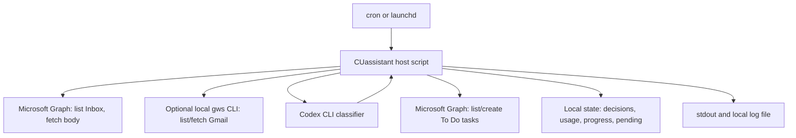

# CUassistant IT Review Notes

This note describes the current shipping behavior for anyone reviewing the
Microsoft 365 consent and data-flow shape. It intentionally describes what
exists today, not the larger campus-agent direction.

These notes were prepared after a Codex-assisted review of the current codebase.
They are meant to make the implementation easier to inspect; they are not a
formal security certification.

## Summary

CUassistant is a single-user, cron-driven email triage script. It reads new
inbox mail, asks Codex to classify bounded email candidates, and creates
Microsoft 365 To Do tasks for messages that create a real obligation.

The agent does not receive Microsoft Graph tools. The host script performs all
mail reads, all To Do writes, all progress tracking, and all audit logging.
Codex receives only the candidate fields needed for classification and returns
schema-constrained JSON.

## Code Review Map

The review surface is split by concern:

| File                          | Review focus                                                |
| ----------------------------- | ----------------------------------------------------------- |
| `src/scan.ts`                 | High-level scan orchestration.                              |
| `src/scan-mail.ts`            | Mail listing, body fetch, and progress cursor writes.       |
| `src/preclassifier.ts`        | Deterministic prefilter decisions.                          |
| `src/residual-classifiers.ts` | Chooses Codex or optional OpenAI residual classification.   |
| `src/openai-classifier.ts`    | Optional lean direct API classifier. Disabled by default.   |
| `src/codex-agent.ts`          | Codex CLI invocation and schema-constrained output parsing. |
| `src/scan-effects.ts`         | Host-applied audit rows and To Do task creation.            |
| `src/ms365.ts`                | Microsoft Graph token refresh and Graph REST calls.         |
| `src/permissions.ts`          | Host operation allow-list for Graph calls.                  |

Additional capabilities would register as separate handlers beside `triage`.
Each one would carry its own skill, declared permission scope, and host-applied
effect path rather than expanding the email triage handler.

## Consent Context

Restore delegated admin consent for the existing GCassistant Azure AD app under
the previously reviewed scope envelope:

- `Mail.ReadWrite`
- `Tasks.ReadWrite`
- `Calendars.ReadWrite`
- `Chat.Read`
- `offline_access`

The scope envelope is broader than the active triage handler. The active handler
refreshes and uses only Mail + To Do access, and the code has no host operation
for sending, deleting, moving, or drafting mail; writing calendar events; or
reading Teams chats.

## Runtime Flow

1. `npm run scan` starts `src/index.ts`.
2. The host loads registered handlers from `src/handlers/` and sets the active
   handler context before provider calls.
3. The only registered handler today is `triage`; future capabilities would
   register beside it with their own skill, permissions, and host-applied effect
   path.
4. The triage handler lists new Inbox messages from configured accounts.
5. Depending on mode:
   - `MODE=agent`: fetch normalized bodies for all listed messages and send
     them to Codex for classification.
   - `MODE=hybrid`: apply deterministic host shortcuts first; fetch bodies and
     send only unresolved messages to the selected residual classifier
     (`RESIDUAL_CLASSIFIER=codex` by default, or `openai` for the lean direct
     API path).
   - `MODE=compare`: run Codex against all listed messages and log how the
     deterministic shortcuts would have compared. This mode creates no tasks
     and advances no progress cursor.
     The deterministic shortcuts are local YAML/string matching only; they do not
     call OpenAI, Codex, or any model.
6. If a classifier decision says `needs_task=true`, the host writes a durable
   `task-intent` audit row before calling Graph.
7. The host checks for an existing To Do task with the same CUassistant audit
   marker, then creates a task only if needed.
8. The host writes the terminal decision row to `state/decisions.jsonl`.
9. The progress cursor advances only after durable decisions and pending
   classifier failures are written.

## Data Flow

## Data Sent To Codex

The Codex prompt contains:

- `AGENT.md` persona text.
- `skills/triage/SKILL.md` classification instructions.
- The configured taxonomy folder names and descriptions.
- For each candidate email: account label, email id, sender, subject, body
  hint, and normalized body text when body fetch succeeds.

The Codex prompt does not include:

- Microsoft refresh tokens.
- Azure app secrets.
- `.env` contents.
- Local workspace files outside the authored prompt files.
- Microsoft Graph tools or credentials.

Codex is invoked with an isolated temporary working directory, read-only
sandbox mode, ignored user config/rules, an output schema, and a timeout.

## Microsoft Graph Operations

The active handler can call only these host operations:

| Operation               | Purpose                                                  |
| ----------------------- | -------------------------------------------------------- |
| `mail.listInbox`        | List Inbox message metadata.                             |
| `mail.fetchBody`        | Fetch and normalize the body for messages sent to Codex. |
| `todo.listLists`        | Find the user's default To Do list.                      |
| `todo.findTaskByMarker` | Avoid duplicate tasks after crash/retry.                 |
| `todo.createTask`       | Create an actionable-mail task.                          |

The allow-list lives in `src/permissions.ts`. Every Graph helper asserts the
active handler is allowed to perform the operation before making the request.

## What It Does Not Do

The current code does not:

- Send email.
- Create drafts.
- Move, archive, or permanently delete email.
- Write calendar events.
- Read Teams chats.
- Run an MCP server.
- Run as a daemon.
- Provide the agent with Microsoft Graph tools.
- Send notifications to Slack, Teams, email, webhooks, or any other outbound
  channel.

## Local State And Audit

Local state lives under `STATE_DIR` and is chmod'd best-effort to private
permissions:

- `decisions.jsonl`: append-only audit log for every decision.
- `usage.jsonl`: model, mode, token counts, latency, and API-equivalent cost.
- `progress.yaml`: last completed scan cursors.
- `pending_residuals.jsonl`: messages that need retry after classifier or task
  failure.
- `scan_in_progress.lock`: prevents overlapping cron/manual scans.

For task creation, the audit sequence is intentionally durable:

1. Append `task-intent`.
2. Check for an existing task by CUassistant audit marker.
3. Create the To Do task if needed.
4. Append the terminal `task` row with the task id or recovered marker match.

## Classifier Backends

Codex remains the default classifier backend and is always used for `MODE=agent`
and `MODE=compare`. For `MODE=hybrid`, unresolved residuals can optionally use
`RESIDUAL_CLASSIFIER=openai`, which calls OpenAI Chat Completions directly from
the host process.

The direct API path is intentionally narrow:

- one API call per unresolved email;
- no tools, MCP server, or agent loop;
- compact prompt containing only classification instructions, taxonomy, sender,
  subject, hint, and normalized body;
- JSON-only output via `response_format: { type: "json_object" }`;
- host-side taxonomy validation, task-title sanitization, durable audit, and
  host-applied side effects.

This is the low-token path for avoiding Codex agent-context overhead on
residuals. It is explicit, not a fallback: it runs only when
`MODE=hybrid`, `RESIDUAL_CLASSIFIER=openai`, and `OPENAI_API_KEY` are set.

Deterministic shortcuts and the lean direct classifier are retained only as
cost-control layers. The Codex agent remains the default classifier and tuning
benchmark, and `MODE=compare` is the mechanism for checking whether host rules
still agree with the agent.

Earlier testing of the broader cost-control prototype dropped a 50-email triage
run from about 5M tokens to about 50K tokens. That result came from two
optimizations together: zero-token deterministic shortcuts for obvious repeated
patterns, and the lean direct classifier for remaining hard cases instead of
full agent context.

## Local LLMs As A Future Privacy Control

Local LLM routing is not part of the current consent request. It is a plausible
future privacy control for categories where email content should not leave the
managed endpoint, but adding it now would expand the code and review surface.

If this grows beyond a single-user project, the clean way to add local models is
as a policy-controlled classifier backend with an explicit route such as
`local_only`. The host would keep the same boundary it has today: it fetches
mail, sends bounded candidate text to the classifier, validates JSON output, and
applies side effects itself. The policy decision would be per capability or per
data class, for example:

- high-sensitivity categories: local-only classifier;
- ordinary administrative triage: Clemson-approved ChatGPT/Codex path;
- compare mode: run both only when allowed and log agreement rates.

That is useful as a roadmap item, but it should stay out of the current
implementation until there is an approved local model runtime, endpoint
management story, and quality benchmark against the Codex classifier.

## Notes And Tradeoffs

- `Mail.ReadWrite` is a broad delegated scope even though the code does not
  expose send/delete/move/draft operations. The mitigation is code-level
  operation allow-listing plus reviewable absence of those call sites.
- The local `.env` contains a refresh token. It is gitignored and the login
  helper writes it with mode `0600`, but endpoint hardening is still an
  endpoint-management responsibility.
- `OPENAI_API_KEY`, when configured for `RESIDUAL_CLASSIFIER=openai`, is also a
  local secret in `.env` and should be handled under the same endpoint-secret
  controls.
- Optional Gmail support uses a local `gws` CLI if configured. It is separate
  from the Microsoft consent ask and can be disabled by leaving `GWS_BIN` unset.
